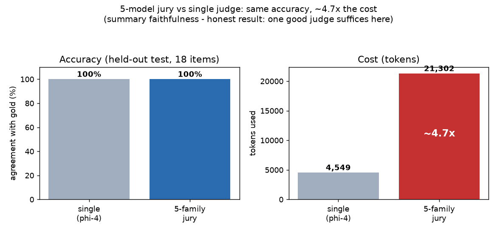
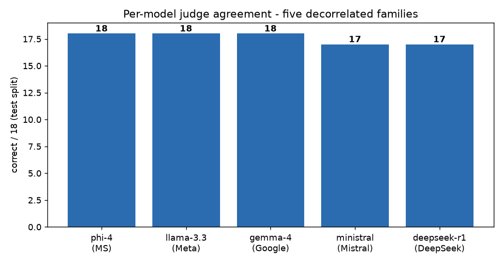
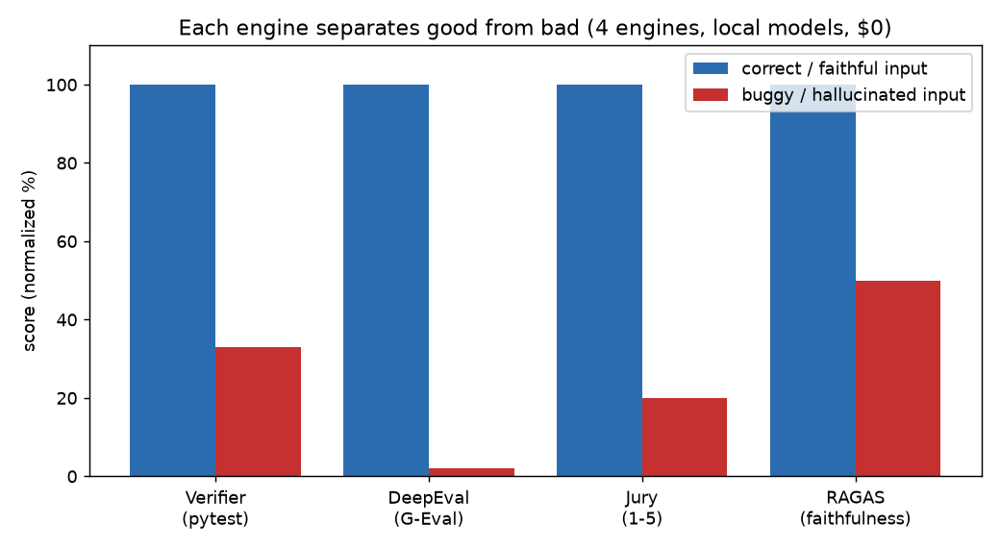

# Local LLM Eval Lab - a zero-cost, fully local AI evaluation harness

*A hands-on study: can you run industry-standard LLM evaluations entirely on local,
open-weight models - no cloud, no per-call cost, no data leaving the machine - and what do
the numbers actually say? Built and measured in one sitting against LM Studio on a single
consumer GPU.*

## TL;DR

- Stood up **7 evaluation engines across 6 categories** (LLM-as-judge, capability benchmarks,
  agentic/code, RAG, safety/red-team, CI/regression) - all running against local models via
  an OpenAI-compatible endpoint, **$0 inference cost**.
- **garak** produced a real **security finding**: a local model (llama-3.3-8b) was **jailbroken**
  by the DAN probe (100% attack success on that probe).
- **Objective test-verifier** (sandboxed pytest) gives ground truth: a correct solution passes
  **12/12**, an injected bug **4/12** - caught objectively, with model-generated code confined
  to a `--network none` Docker container.
- **Honest headline result:** a 5-model "jury" did **not** beat a single strong judge on summary
  faithfulness. On a held-out 18-item test split, single judge and 5-model jury both scored
  **18/18 (100%)** - the jury cost **~4.7x the tokens for +0 accuracy**. One good local judge is
  enough here; a jury only earns its cost where single-model error is high and de-correlated.
- `qwen2.5-coder-7b` on **GSM8K** (5-shot, 100 items): **0.80 ± 0.04** flexible-extract
  (0.68 strict-match).

> These are connection-proofs at small scale (`--limit` / small samples), chosen to validate
> the wiring and produce defensible figures; scaling to full campaigns is just removing the limits.

## Why

LLM eval platforms charge per call and send prompts to their servers. I wanted to know whether
the *same* open-source eval frameworks run against a free local model, what breaks, and what the
results honestly show - both as a learning exercise and as a reusable, on-prem QA layer.

## What I built

| Engine | Category | Verified result (today) |
|---|---|---|
| Jury (custom, 5-family ensemble) | LLM-as-judge | correct 5/5, buggy 1/5 - discriminates |
| promptfoo | quality + CI + red-team | rubric + assertion pass, judge local |
| DeepEval (G-Eval) | LLM-judge metrics as pytest | good 1.00, buggy 0.02 |
| Objective verifier (custom) | tests in Docker sandbox | correct 12/12, bug 4/12 (ground truth) |
| garak | safety / red-team | **security finding - model jailbroken (DAN 100%)** |
| lm-eval-harness | capability benchmarks | GSM8K 0.80 / 0.68 (n=100, 5-shot) |
| RAGAS | RAG evaluation | grounded 1.00, hallucinated 0.50 |

**Architecture:** models run in LM Studio on the host GPU; every engine reaches them over an
OpenAI-compatible endpoint, and structured output everywhere uses `response_format: json_schema`
(grammar-constrained) - the one format the local server reliably accepts. Each engine lives in
its own venv. Code-executing evals run inside a `--network none` Docker container so
model-generated code never touches the host. See [README.md](README.md) for run commands.

## The honest jury study (the centerpiece)

A common claim is "a panel of diverse models judges better than one." I tested it properly.

- **Task:** summary faithfulness (binary FAITHFUL/UNFAITHFUL), hand-labeled.
- **Method:** 30 items split into **12 calibration / 18 test**; accuracy-weighted voting uses
  weights learned *only* on the calibration split (so it is not circular). Single-judge baseline
  (phi-4) chosen up front, not cherry-picked.
- **Result (test split, 18 items):** single judge **18/18**, jury majority **18/18**, jury
  weighted **18/18** - **+0**, at **~4.7x tokens** (4,549 -> 21,302).



**Takeaway:** for binary faithfulness with strong modern judges, a single good local judge equals
a 5-model jury at ~1/5 the cost. A jury pays off only when the *best* single model still errs
materially - subjective rubrics, adversarial inputs, or weaker models. Reporting this null result
honestly (rather than tuning the set to manufacture a win) is the point: eval engineering is about
measuring cost/benefit, not assuming more models = better.



And the engines do separate good from bad across categories:



## Engineering gotchas I had to debug (the real work)

1. **Local models reject tool-call structured output.** The `verdict` framework (and instructor in
   `Mode.TOOLS`) send `tool_choice` as an object; LM Studio only accepts it as a string -> HTTP 400.
   `Mode.JSON` sends `response_format: json_object`, also rejected. The only accepted form is
   `json_schema`. Fix: drive structured output via `litellm` + `response_format: json_schema`.
2. **instructor 1.7.2 retry bug vs tenacity 9.** `verdict` hard-pins instructor 1.7.2, whose retry
   wrapper throws `Retrying.__call__() got multiple values for 'self'` on every call. Routed around
   `verdict` entirely with direct litellm calls.
3. **I refuted my own hypothesis.** A first run suggested judges split "strict vs lenient" by family;
   a calibration set showed all judges within ±0.2 of truth on objective items - the "family bias"
   was one borderline case, not a stable effect. Kept the negative finding.
4. **Node / Python packaging reality.** promptfoo needed Node >= 20.20 (installed a standalone Node
   22, left the system one alone); DeepEval needed `litellm` added to its venv; lm-eval needed the
   `[api]` extra; RAGAS 0.4.3 hard-imports a removed langchain path (stubbed it).

## Honest caveats

- Small samples (`--limit`, 15-30 item judge sets) - defensible directions, not full campaigns.
- Single consumer GPU (12 GB), models run sequentially; "jury cost" includes per-model JIT loads.
- Hand-labeled gold sets are author-labeled; clear-cut where possible, audit trails included in the
  per-run result files.

## Reproduce

```bash
source env-wsl.sh
jury/.venv/bin/python jury/single_vs_jury_v2.py     # the jury study
jury/.venv/bin/python evals/verifier/verify.py      # objective verifier (Docker)
# garak, lm-eval, deepeval, promptfoo, ragas: see each evals/*/ run header
```

## What I'd do next

- Find the regime where the jury *does* win (weaker judges, or subjective rubrics with human gold).
- Scale one benchmark to a full run for a citable headline number.
- Wire the toolkit into a real app + add Langfuse for continuous production monitoring.
